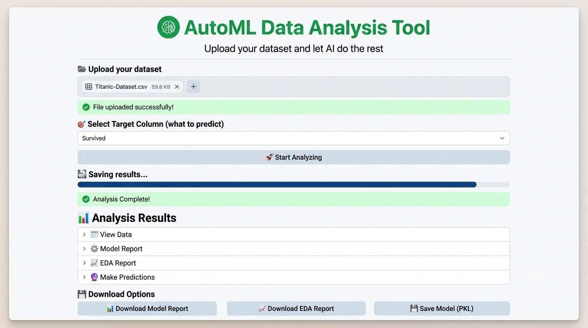

# Intelligent Data Analysis System Using AI Agents

An intelligent machine learning application that automates the complete data analysis workflow—from data preprocessing to model training, evaluation, AutoML, prediction, and report generation. The system is designed to help users analyze datasets with minimal manual effort through an easy-to-use interface.

---
## Main screen



## 📌 Project Overview

The Intelligent Data Analysis System streamlines the machine learning pipeline by automatically performing:

- Data loading
- Data preprocessing
- Exploratory Data Analysis (EDA)
- Automatic problem type detection
- Model training and evaluation
- AutoML (model selection, feature selection, and hyperparameter tuning)
- Prediction on new data
- Automatic report generation

The goal is to reduce manual work while making machine learning accessible to users with limited technical knowledge.

---

## ✨ Features

### 📂 Data Loading
- Load CSV datasets
- Load Excel datasets

### 🧹 Data Preprocessing
- Handle missing values
- Remove duplicate records
- Format correction
- Automatic data type fixing
- Outlier handling using IQR
- Automatic removal of irrelevant columns

### 📊 Exploratory Data Analysis (EDA)
- Dataset summary
- Statistical analysis
- Missing value analysis
- Correlation analysis
- Distribution analysis
- Data visualization

### 🤖 Machine Learning
- Automatic detection of Classification or Regression problems
- Automatic train-test split
- Multiple model training
- Model evaluation

### 🚀 AutoML Engine
- Automatic best model selection
- Automatic feature selection
- Hyperparameter tuning using GridSearchCV
- Model performance summary
- AI-based recommendation

### 🔮 Prediction
- Predict outcomes for new datasets
- Single record prediction

### 📄 Reporting
- Generate structured model reports
- Performance summary
- Best model information
- Selected and removed features
- Hyperparameter details

---

## 🏗️ Project Structure

```text
Intelligent-Data-Analysis-System-Using-AI-Agents/
│
├── app.py
│
├── modules/
│   ├── loader.py
│   ├── data_cleaner.py
│   ├── eda.py
│   ├── train_modules.py
│   ├── autoML.py
│   ├── prediction.py
│   └── generate_report.py
│
|
├── requirements.txt
│
└── README.md
```

---

## ⚙️ Machine Learning Workflow

```text
Dataset Upload
        │
        ▼
Data Cleaning
        │
        ▼
Exploratory Data Analysis
        │
        ▼
Problem Type Detection
        │
        ▼
Train/Test Split
        │
        ▼
Model Training
        │
        ▼
Model Evaluation
        │
        ▼
AutoML
 ├── Feature Selection
 ├── Hyperparameter Tuning
 └── Best Model Selection
        │
        ▼
Prediction
        │
        ▼
Report Generation
```

---

## 🧠 Supported Machine Learning Models

### Classification

- Logistic Regression
- Decision Tree Classifier
- Random Forest Classifier

### Regression

- Linear Regression
- Decision Tree Regressor
- Random Forest Regressor

---

## 📈 Evaluation Metrics

### Classification

- Accuracy
- Precision
- Recall
- F1-Score

### Regression

- RMSE
- MAE
- R² Score

---

## 🛠️ Technologies Used

### Programming Language

- Python

### Machine Learning

- Scikit-learn

### Data Processing

- Pandas
- NumPy

### Data Visualization

- Matplotlib
- Seaborn

### Frontend

- Streamlit

### Model Persistence

- Joblib

---

## 🚀 Installation

Clone the repository:

```bash
git clone https://github.com/fakhur29/Intelligent-Data-Analysis-System-Using-AI-Agents.git
```

Move into the project directory:

```bash
cd Intelligent-Data-Analysis-System-Using-AI-Agents
```

Install the required packages:

```bash
pip install -r requirements.txt
```

Run the application:

```bash
streamlit run app.py
```

---

## 📋 How to Use

1. Launch the Streamlit application.
2. Upload a CSV or Excel dataset.
3. Select the target column.
4. Click **Start Analysis**.
5. Wait for the automated pipeline to complete.
6. View:
   - Dataset Preview
   - EDA Report
   - Model Report
7. Make predictions using:
   - A new dataset
   - Single record input
8. Download reports or save the trained model.

---

## 📊 Outputs

The application provides:

- Cleaned dataset
- EDA report
- Trained machine learning models
- Best model selection
- Feature selection results
- Hyperparameter tuning results
- Prediction results
- Downloadable model report
- Downloadable EDA report
- Saved trained model (.pkl)


---

## 👨‍💻 Author

**Fakhur Ali**

Department of Information Technology

Final Year Project

---

## 📄 License

This project is developed for educational and research purposes.

